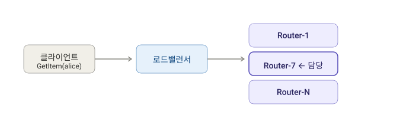
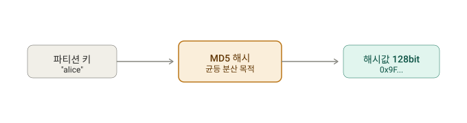
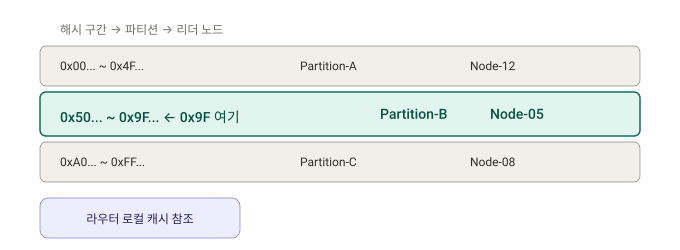
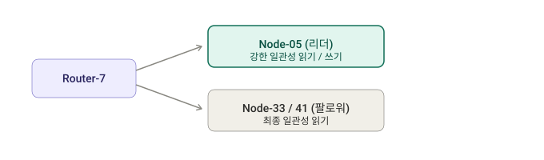
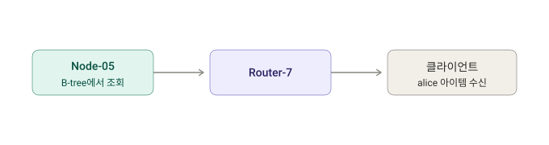

# 스터디 공유 내용


## Schema Less 하다는 것, 테이블 하나가 여러 엔티티를 나타낼 수 있다는 것은 무슨 의미일까?

### DDB는 스키마 Less 하다? == 키 스키마만 만족시키면 내용은 자유로움
- DDB에서 테이블 정의에 만드는 것은 (파티션 키, 정렬 키)일 뿐, 나머지 속성은 제각각이어도 됨
  - RDB는 모든 컬럼을 못박아둠(CREATE TABLE)
  - 그런데 DDB는 키 스키마(PK, SK)만 공유하면 내용은 신경을 쓰지 않음
  - 키는 고정 나머지 속성은 자유
```text
{ PK: "USER#1",  name: "Alice", email: "a@x.com" }
{ PK: "USER#2",  name: "Bob",   age: 30, country: "KR" }   ← 속성 구성이 다름
{ PK: "TEAM#7",  teamName: "Falcons", memberCount: 12 }     ← 아예 다른 엔티티
```

### DDB는 하나의 테이블에 여러 Entity를 담을 수 있다?
- DDB에선 일부러 하나의 테이블에 데이터르 몰아넣음
  - 파티션 키 : 엔티티 타입을 접두어로
  - 정렬 키 : 관계나 하위항목 표현
```text
PK              SK                  속성
TEAM#7          #META               teamName: "Falcons"
TEAM#7          USER#1              role: "captain", joinedAt: ...
TEAM#7          USER#2              role: "member",  joinedAt: ...
TEAM#7          USER#5              role: "member",  joinedAt: ...    
```
- B-Tree 순으로 저장되기 때문에 TEAM#7-> 메타데이터부터 이 팀에 속한 하위 유저까지 딸려나옴
- DDB는 조인이 안되기 때문에 애초에 같은 파티션에 물리적으로 데이터를 붙여둠

---

## Partition Key가 Hash Key로 불리는 이유

- 파티션 키가 내부의 물리적 저장 위치를 정함
- 파티션 키 -> 해쉬 함수(MD5) -> 해쉬함수가 적용된 파티션 키 (X - 128비트 해쉬값)
  - 목적 : 균등 분산
    - MD5는 출력이 입력 전체에 걸쳐 고르개 퍼지는 특성 때문에 쓰임
    - 카디널리티가 높고 값이 골고루 분포된 파티션 키를 고르면 핫 파티션을 피할 수 있음
  - 복합 키(파티션 키 + Sort Key)의 경우 파티션 키만 해쉬 대상임 
    - Sort Key의 경우 같은 파티션 키 내부에서 정렬 키가 됨
  - 오직 키 설계로만 분산을 유도하고 파티션 매핑, 리밸런싱 등은 AWS가 관리형으로 처리해줌

---

## DDB는 해쉬 키 충돌 어떻게 해결하나?
- 128비트 출력이라 천문학적으로 낮음
- 충돌이 나도 -> 해쉬키는 파티션 라우팅 용도지 직접 데이터는 원본값으로 비교함

---

## 파티션 라우팅 흐름 정리
- Request Router
  - 요청을 받아 전달할 파티션 대상을 알아내고 라우팅까지 주도
  - Stateless하고 앞단에 여러대가 떠 있음
- MetaData Service
  - 각 테이블의 어떤 키 해쉬 구간이 어떤 파티션에 매핑되는지
  - 그 파티션의 물리적 위치가 어디인지를 들고 있는 룩업 테이블 같은 존재
- Storage Node
  - 실제 데이터가 B-Tree 형태로 저장되고 복제 되는 곳
  - 리더/팔로워 복제본이 들어있음
  - 하나의 스토리지 노드는 여러 파티션 복제본이 들어 있을 수 있음(Storage Node1이 파티션 A의 복제본이자 파티션 B의 리더일 수 있음)

User 테이블에 파티션 키가 user_id이고 GetItem(user_id = 'alice')를 날린 상황
해싱으로 키 산출 -> 메타데이터 기반 노드 알아내기 -> 리더/팔로워에게 전달

**1. 요청 도착**
- 로드 밸런서가 여러 Request Router 중 하나(ex. Router-7)로 넘김(StateLess 해서 동작상관 없음)


**2. 해싱**
- Request Router가 요청키값 'alice'를 해싱 -> `0x97...` 이라는 128비트 해쉬키 산출


**3. 메타데이터 룩업**
- MetaData Service에게 해쉬키가 어느 파티션에 속하는지 물어봄
- MetaData Service는 이런 룩업테이블을 지님
```text
해시 구간                        →  파티션      →  스토리지 노드
0x00... ~ 0x4F...               →  Partition-A  →  Node-12 (leader), Node-19, Node-27
0x50... ~ 0x9F...               →  Partition-B  →  Node-05 (leader), Node-33, Node-41
0xA0... ~ 0xFF...               →  Partition-C  →  Node-08 (leader), Node-15, Node-22
```


- 이 경우 0x9F는 Partition B로 떨어짐 -> 리더는 Node5
- 라우터는 해당값을 로컬 캐싱하두고 캐시가 오래됐거나 miss가 나면 Lazy로 갱신

**4. 실제 노드로 전달**
- 강한 일관성 읽기 -> Leader로 전달
- 최종적 일관성 읽기 -> 팔로워 아무데나 읽음


약- Node-05가 B-Tree에서 'alice'아이템을 찾아 Router-7에게 주고 Router가 클라에게 반환
- 해쉬키는 라우팅 용도로만 쓰이고 실제 아이템을 비교할 때는 원래 키 값 자체로 구분함


### 만약 파티션 분할이 일어나면 -> PartitionB에 요청이 몰려 쪼개진 상황
```text
0x50... ~ 0x77...  →  Partition-B1  →  Node-05 ...
0x78... ~ 0x9F...  →  Partition-B2  →  Node-44 ...   (새로 생긴 쪽)
```

- 라우터가 이전 캐시를 들고 예전 Node-05로 라우팅 -> Node05가 '이 데이터 나한테 없음' 응답을 보내거나 라우터가 stale 감지
- 메타 데이터 리프레시 후 Node-44로 재라우팅을 맞추는 방식
