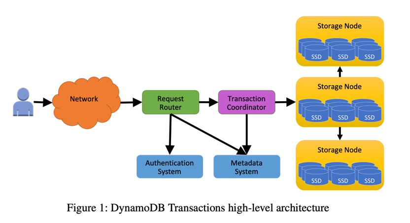
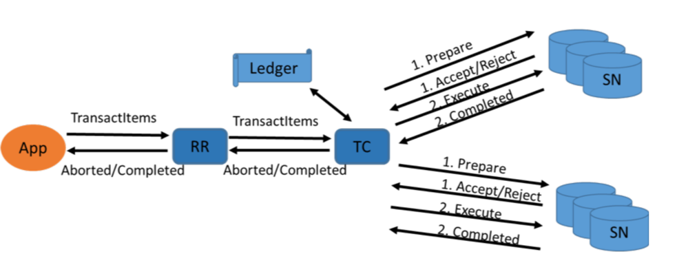
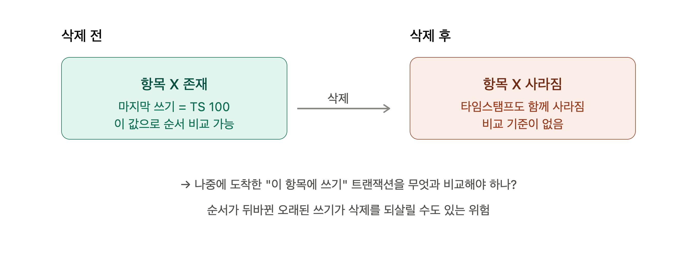
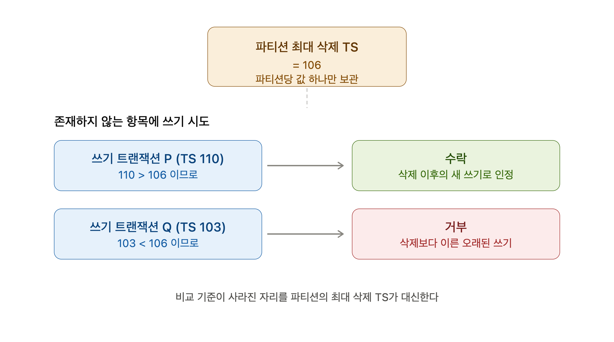

# TransactionWriteItems API
- 최대 100개 쓰기 작업 한번에
- 동일 리전, 동일 AWS rPwjd
- 트랜잭션 내 항목 총크기 4MB

## 동일 트랜잭션 내 동일한 항목을 여러 작업 대상으로 지정 못함
- Put, Update, Delete, ConditionCheck
- Why? 여러 작업을 순차로 실행하는 것이 아니라 함께 병렬 실행 -> 무엇을 먼저 실행할지 모름
- 트랜잭션 완료 -> 변경사항이 GSI, 스트림, 백업 전파

## TransactionGetItems는 언제쓸까
- 트랜잭션에서 수정된 항목의 원자 스냅샷을 보장하려면 TransactionGetItems로 모든 관련 항목을 함께 읽음
- 데이터에 대한 일관된 보기를 제공하므로 완료 트랜잭션의 모든 변경사항을 보거나 전혀 볼 수 없음

- GetItem/BatchGetItem은 각각 독립적인 읽기라 일관성 보장이 안됨

```text
내가 항목 A를 읽음        ← 트랜잭션 T의 변경 전 값
↑ 이 사이에 트랜잭션 T가 커밋됨
내가 항목 B를 읽음        ← 트랜잭션 T의 변경 후 값
```
- 결과적으로 A는 옛날 값, B는 새 값 — 트랜잭션이 반쯤 걸쳐진 찢어진(torn) 상태를 보게 됨
- TransactGetItems는 읽는 도중에 다른 트랜잭션이 중간에 끼어들 수 없어서 일관된 읽기가 가능 


## 멱등성
- CRT : 클라이언트 토큰으로 멱등성 확인 가능(10분 유효)
- 동일한 CRT여도 다른 요청 파라미터인 경우 IdempotentParameterMismatch 예외 반환
- 연결시간 초과 및 연결 문제로 중복 호출될 경우 애플리케이션 오류 방지 가능
- ReturnConsumeCapacity -> 소모된 WCU 값 반환, 후속 요청은 항목을 읽는데 사용된 RCU 값 반환

## 쓰기 오류 처리
- 조건식 중 하나의 조건이 충족되지 않는 경우
- 동일한 TransactWriteItems 작업 내 여러 작업에서 동일한 항목을 대상으로 지정
- 트랜잭션을 완료하기 위한 프로비저닝 용량이 부족한 경우
- 두개의 쓰기 트랜잭션 작업이 같은 항목을 동시에 건드리면 나중것은 실패함
- 트랜잭션에 의한 변경으로 인해 항목 크기가 지나치게 커지거나(400KB 초과), 로컬 보조 인덱스(LSI)가 너무 커지거나, 유사한 검증 오류가 발생하는 경우

---

# TransactionGetItems
- 최대 100개의 작업을 그룹화하는 동기식 읽기 작업
- 총 4MB를 초기화할 수 없음

## 읽기 오류 처리
- 트랜잭션 쓰기 작업 중에 여러 항목을 읽으면 일부는 새값, 일부는 옛날 값을 볼 수 있음
```text
트랜잭션 쓰기: 항목 1, 2, 3을 수정 중  ← 아직 진행 중
트랜잭션 읽기: 항목 3, 4를 읽으려 함
                    ↑
              항목 3이 겹침!
```
- TransactionGetItems가 같은 항목을 건드리는 TransactionWrtieItems와 겹치면 실패함
- 트랜잭션을 완료하기 위한 프로비저닝 용량이 부족한 경우
- 사용자 오류(예: 잘못된 데이터 형식)가 발생하는 경우

## 트랜잭션 겹침 오류
| 선행 (진행 중) | 후행 (새 요청)                                           | 취소 여부 | 이유 |
|---|-----------------------------------------------------|:---:|---|
| TransactWriteItems | TransactWriteItems, PutItem, UpdateItem, DeleteItem | ✅ 취소 | 같은 항목을 동시에 수정 → 원자성 훼손 방지 |
| TransactWriteItems | TransactGetItems                                    | ✅ 취소 | 수정 중인 항목을 읽음 → 찢어진 스냅샷 방지 |
| TransactGetItems | TransactWriteItems, PutItem, UpdateItem, DeleteItem |                                  | ✅ 취소 | 원자적 읽기 중 값 변경 → 읽기 일관성 보호 |
| TransactGetItems | TransactGetItems                                    | ❌ 정상 | 읽기끼리는 값을 바꾸지 않음 → 충돌 없음 |

---

# Transaction Isolation

## Serializable
- 여러 연산이 동시에 실행이 되어도 마치 그 결과가 하나가 완전히 끝난 다음에 다음것이 시작된 거서럼 보장

### 직렬성이 보장되는 3가지 조합
- 트랜잭션 연산 & 일반 쓰기(PutITem, UpdateItem, DeleteItem)
- 트랜잭션 연산 & 일반 읽기(GetItem)
- TransactWriteItem <-> TransactGetItems


## Read-Committed
- 커밋된 값만 본다 : 성공하지 못한 트랜잭션의 중간 상태는 절대 보지 않음
- 읽은 직후의 수정은 막지 못한다 : 읽은 순간 커밋된 값이었지만 그 값이 유지된다는 보장은 없음
- BatchGetItem, Query, Scan의 격리수준이 read-committed
```text
Query가 항목들을 순서대로 훑는 중:
  항목 1 읽음 (옛날 값)
  항목 2 읽음 (옛날 값)
     ↑ 이 사이에 트랜잭션 쓰기가 항목 3을 커밋
  항목 3 읽음 (새 값) ←  같은 Query인데 여기서부터 새 값!
  항목 4 읽음 (새 값)
```

---
# Transaction 용량
- 항목된 Prepare -> Commit으로 일반 읽기/쓰기를 2번 작업 => RCU,WCU도 2배 작업
- 트랜잭션이 실패해도 RCU/WCU는 소비됨

---

# Reference
- https://docs.aws.amazon.com/ko_kr/amazondynamodb/latest/developerguide/transaction-example.html

---

# 논문 요약

- 핵심 과제 : NoSQL DBd의 확장성, 높은 가용성, 대규모에서 예측 가능한 성능을 희생하지 않으면서 트랜잭션 연산을 지원하는 일
- 특징1.  트랜잭션이 단일 요청으로 제출됨
  - BEGIN/COMMIT -> 시작, 커밋 사이에 오랜 시간이 걸릴 수 있음(시스템 자원을 묶어둠)
  - DDB : 블로킹 없이 성공하거나 실패

- 특징2. 트랜잭션 코디네이터에 의존하지만 비트랜잭션 연산은 2 phase coordinate를 우회
  - 모든 비트랜잭션 연산은 다중 항목 트랜잭션에 대해 직렬화, 접근되는 데이터 스토리지 서버에서 직접 시행

- 특징3. 제자리에서 업데이트 됨
  - MVCC -> 데이터를 쓰는 트랜잭션이 새 버전을 생성 => 대규모 변경과 버전 보존 정책을 필요로 함
  - DDB는 여러 버전을 지원하지 않음 -> 단일버전 저장소 -> 읽기 트랜잭션 vs 쓰기 트랜잭션 충돌 가능

- 특징4. Lock 획득 안함
  - 잠금 - 동시성 제한, deadlock 유발, 커밋 실패 시 잠금 해제 메커니즘 필요,
  - 잠금을 완전히 배제하는 낙관적 동시성 제어 방식을 사용함

- 특징5. 타임 스탬프를 통해 직렬적으로 순서가 정해짐
  - 각 트랜잭션에 직렬 순서에서의 위치를 정의하는 타임스탬프를 할당

## 트랜잭션 연산
- TransactionGetItems : 단일 시점에 일관된 스탭샷에서 최신 버전을 검색함
- TransactionWriteItems : 동기적이고 멱등적인 쓰기 연산 
  - CRT(Client Request Token)을 활용하여 멱등키 활용
  - Precondition을 포함할 수 있으며 사전 조건 중 하나라도 충족되지 않으면 TransactionWrtieItems 거부

## 트랜잭션 실행

### 트랜잭션 라우팅
- Request Router에서 수신 -> 필요한 인증 및 권한 부여 수행 후 트랜잭션 코디네이터 집합으로 전달
- 집합 내의 어떤 트랜잭션 코디네이터 든 어떤 트랜잭션에 대해서 책임을 맡음
- 트랜잭션 코디네이터의 역할 : 트랜잭션을 항목 단위 연산으로 분해, 스토리지 노드가 참여하는 분산 프로토콜 실행



### 타임스탬프 순서 지정
- 트랜잭션의 논리적 실행 순서 정의 -> 현재 clock 값을 통해 트랜잭션에 타임스탬프 할당
- 다수의 트랜잭션 코디네이터가 병렬로 동작하며 트랜잭션에 타임스탬프 부여
- 각 스토리지 노드는 자신의 항목과 관련된 요청을 순서대로 실행, 제대로 순서를 정할 수 없는 충돌 트랜잭션을 거부
- 코디네이터 집합의 클록은 AWS 타임싱크 서비스에서 동기화 됨
- but, 메시지 지연, 장애 복구 등으로 트랜잭션이 노드에 순서가 바뀐채 도착가능함 -> 저장된 타임스탬프를 통해 순서대로 처리함

### 쓰기 트랜잭션 프로토콜
- 1단계 : Prepare : Primary 스토리지 노드에 메시지를 보냄
  - 준비 메시지 : 타임스탬프, 트랜잭션Id, 항목에 수행하려는 연산이 포함됨
- 2단계 : 트랜잭션 커밋하고 스토리지 노드에게 쓰기를 지시 -> 하나라도 수락할 수 없으면 트랜잭션 취소
- 모든 항목에 쓰기 연산의 타임스탬프 기록 -> 모든 쓰기 연산은 항목 타임스탬프를 업데이트 함
- 스토리지 노드는 트잭션 식별자 및 메타데이터를 지속적으로 저장함

- 모든 참여 스토리지 노드가 커밋이나 취소를 실행한 후 -> 완료 메시지와 함께 성공정 커밋 여부를 요청 라우터에 응답


- 삭제의 경우 : 논리적 삭제가 아닌 파티션 단위의 최대 삭제 시간 보관
  - 타임스탬프를 통해 마지막 쓰기 타임프 기준으로 새 트랜잭션을 받을지 말지 판단
  - 그런데 삭제하면 -> 항목이 사라짐, 비교할 마지막 쓰기 타임스탬프도 사라짐
  - 논리적 삭제가 방법임 -> 그러나 가비지 컬렉션이나 스토리지 비용이 계속 쌓임
  - 

  - 파티션 하나당 딱 하나의 값만 남김 - 최대 삭제 타임스탬프(가장 최신 삭제 이벤트 시간)
    - 항목이 삭제될때 최신 삭제 스탬프와 비교해 그것보다 이후의 타임스탬프면 갱신
    - 스토리지 노드가 존재하지 않는 항목에 대해 쓰기 준비 메시지를 받으면 최대 타임스탬프와 비교
    - 

### 읽기 트랜잭션 프로토콜
- 1단계 : 읽기 집합에 있는 모든 항목 읽기
  - 하나라도 다른 트랜잭션에 의해 쓰여지고 있다면 트랜잭션은 거부됨
  - 스토리지 노드가 항목의 값과 - 현재 커밋된 로그 시퀀스 번호 반환 
- 2단계 : 로그 시퀀스 번호를 통해 변경 감지하고 거부 여부 선택
  - 다시 읽음 -> 변경이 없었다면 (LSN)이 변경되지 않았다면 모든 항목 값을 성공적으로 반환함

### 복구 및 내결함성
- 공유 트랜잭션 원장(DDB 테이블)을 관리하여 하나의 코디네이터에서 문제가 발생하면 -> 다른 코디네이터가 재개
- 멱등성이 유지되므로 중복쓰기 시고에 대해서도 동시에 같은 트랜잭션을 완료해도 괜찮음
- 복구 관리자가 지연된 트랜잭션 처리를 위해 원장을 병렬로 ㅅ스캔
