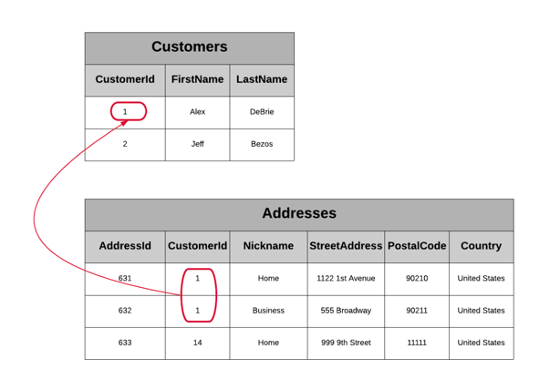
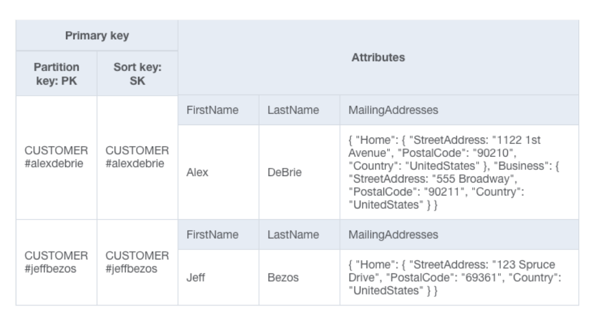
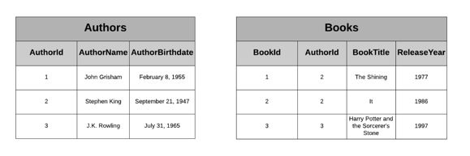
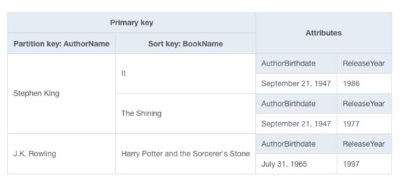
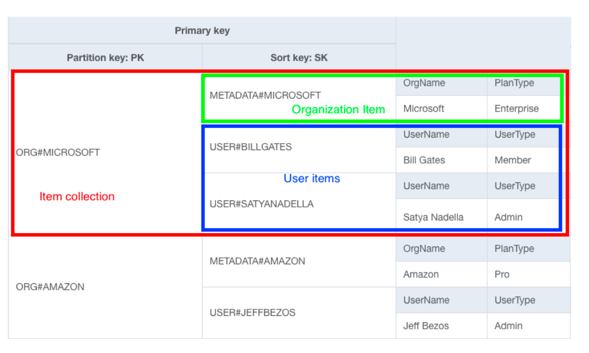
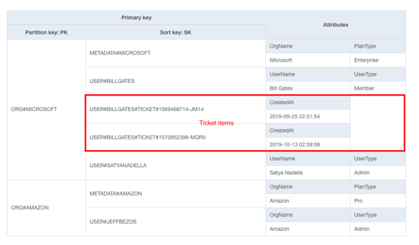
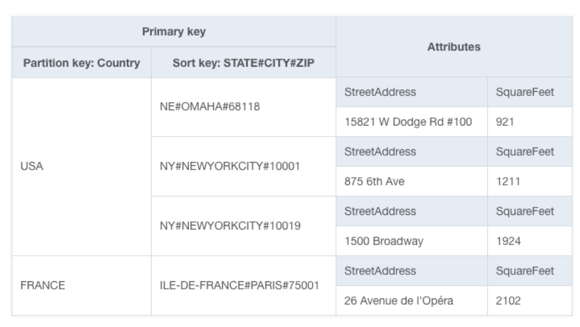

# 10. 전략의 중요성

- 다양한 DDB 데이터 모델링 전략을 이해하고 있음으로서 DDB를 100% 활용가능하다

### RDB에서의 모델링 : 보편적인 룰 존재
- 데이터 중복 -> 정규화
- 1:N -> 외래키
- N:M -> join 활용

### DDB : 문제 접근방식이 다양함
- 1:N을 다루는 5가지 방식이 있을 만큼 다양한 접근 가능

# 11. 1:N 모델링 5가지 전략
- Parent-Children 관계는 매우 다양함
  - Workplace : 하나의 워킹장소에 다양한 employees 존재 가능
  - E-commerce : customer - 1: N - 다양한 주문 가능
  - Saas : 하나의 조직 - 여러 user 속할 수 있음

## 주요 질문 : 어떻게 parent enttiy 관련 객체들을 가져오나?
- RDB : 외래키 + 조인

## 전략1. complex(list, map) attribute
- 제 1정규화 : 원자속성값을 어긋나게 함
- ex) E-commerce
  - 한 소비자가 여러 이메일 주소 소유 가능
  - RDB는 다음과 같이 customers, addresses를 각각 다른 테이블로 모델링 할 것
  - 
  - DDB는 Mailing Addresses라는 list 속성을 만들어 품을 수 있음
  - 

  
- Complex Attribute를 사용하는 두가지 질문
  **- complex attribute 안의 value를 통한 접근 패턴이 있는가?** 
    - 모든 접근은 PK 혹은 index를 통해서만 가능 -> complex 내의 요소를 기반으로 가능하지 않음
    - 예를 들어 위의 예시에서는 이메일 기반으로 유저를 fetch 하는 것이 불가함
  - complex 속성 값이 아이템 기준값(400KB)을 초과하진 않는지?
    - list, map에 속한 데이터량이 단위 아이템 용량(400KB) 초과가능성이 있는지 고려
    - 예를 들어 애플리케이션에서 최대 20개의 주소까지만 삽입할 수 있도록 제한하는 등의 액션 필요

---

## 전략2. duplicating data
- 제 2 정규화(부분 종속)을 파괴화는 방법
- 제 2정규화를 만족시키기 위해서는 : 주키가 아닌 속성들이 부분이 아닌 모든 키 조합에 종속되어야 한다는 것
- 역정규화의 핵심인 데이터 중복 <-> update 정규성 챙겨주기의 트레이드 오프를 잘 고려할 것

## 작가와 Book 관계 모델링 (1:N)

### RDB에서의 접근 : Authors, Books 테이블
- 작가가 쓴 책들을 가져오려면 Join 필요

### DDB에서의 접근 : PK(AuthorName) + SK(BookName), Attribute(작가, 책에 대한 정보), 

- 작가에 대한 생애 정보가 작가가 쓴 책만큼 중복되어 저장됨
- 중복되어 저장되는 생애 정보는 변경여지가 크게 없으므로 가능

### Duplicate data를 쓸 때 주의점 : 중복 저장 데이터의 변경 가능성
- 중복된 정보는 변동 가능성이 없는가? -> 변경될 경우 다양한 데이터를 한번에 변겨잇켜야 함
- 데이터가 변경된다면 -> 어느정도 간격으로, 어떤 사이즈로 변경되나?

---

## 전략3. Composite PK + Query API
- PK를 Parent Enttiy Key, SK에서 Child Entity Key를 분리하여 복하ㅂ키로 설계
- item collections : 같은 파티션 키를 공유하는 item들 집합
- Query API -> 중복 아이템을 하나의 아이템 컬렉션으로 다룰 수 있음 -> 다른 타입 아이템들을 마치 조인처럼 다룰 수 잇음
  
ex)
- SaaS 서비스 구독 기관과 그 기관에 속하는 User를 SK(METADATA, USER)를 통해 구분

- 초록 부분 : org item type
- 파랑 부분 : user item type
- 접근1. 기관 단독 -> GetItem(PK : ORG#<OrgName>, SK : METADATA#<OrgName>)
- 접근2. 기관 + Users-> Query API(PK : ORG#<OrgName>) -> join 없이 가능
- 접근3. Users -> Query API(PK : ORG#<OrgName>, SK : begins_with(USER#))
- 접근4. USER 한명 -> GetItem(PK : ORG#<OrgName>, SK : eq(USER#<Username>))

---

## 전략4. Secondary index + the Query API action
- 만약 Main Table이 다른 접근 패턴에 맞춰 설계되었다면 GSI를 사용해야함

ex) Zendisk -> 하나의 기관의 유저 여러명있고 -> 하나의 유저가 여러개의 ticket 사용 가능
- 기존 Composite Key를 이용하면 SK를 METADATA, USER, USER#Ticket을 통해 org, user, ticket을 함께 조회 가능

- 문제점 : 나의 메인 접근 패턴을 이 설계를 통해 영향 받을 수 있음
  - 기관 + Users를 조회하려고 하는데 Tickets들도 이제 함께 조회됨
  - Ticket이 너무 많아버리게 되면 페이지네이션 시 필요없는 데이터를 반복조회할 수 있음

### 3단계 대응법
- 1단계 : Ticket을 메인 테이블에서 별도 아이템 컬렉션으로 분리
  - Ticket PK, SK를 TICKET#<TicketId> -> Org 파티션에 섞이지 않고 티켓 ID로 바로 단건 조회 가능
- 2단계  : GSI1 생성
  - 키가 GSI1PK, GSI1SK인 글로벌 보조 인덱스
- 3단계 : User와 Ticket 아이템 모두에 GSI1 키 값 넣기
  - GSI1PK = ORG#<OrgName>#User#<UserName>으로 같은 값을 넣어 GSI 안에서 같은 파티션에 모이게 함
  - User SK - GSI1SK = User#<UserName>
  - Ticket SK - GSI1SK = TICKET#<TicketID>

**메인 테이블**

| PK | SK | 타입 | GSI1PK | GSI1SK |
|---|---|---|---|---|
| ORG#Microsoft | METADATA#Microsoft | Org | | |
| ORG#Microsoft | USER#alex | User | ORG#Microsoft#USER#alex | USER#alex |
| ORG#Microsoft | USER#bob | User | ORG#Microsoft#USER#bob | USER#bob |
| TICKET#001 | TICKET#001 | Ticket | ORG#Microsoft#USER#alex | TICKET#001 |
| TICKET#002 | TICKET#002 | Ticket | ORG#Microsoft#USER#alex | TICKET#002 |

**GSI1** (GSI1PK 기준으로 재정렬됨)

| GSI1PK | GSI1SK | 타입 |
|---|---|---|
| ORG#Microsoft#USER#alex | TICKET#001 | Ticket |
| ORG#Microsoft#USER#alex | TICKET#002 | Ticket |
| ORG#Microsoft#USER#alex | USER#alex | User |
| ORG#Microsoft#USER#bob | USER#bob | User |

- GSI에서 item collection을 재정의할 수 있음 -> User, Ticket 조합으로
- User가 파티션의 마지막 아이템이 되도록 구조를 짠 이유
  - Ticket이 타임스템프 별로 정렬되기 때문에 User와 함께 User의 가장 최근 티켓들을 가져오고 싶을 것
  - User가 아이템 컬렉션 맨 끝에 오도록 순서 + `ScanIndexForward=False`룰 통해 DDB가 컬렉션 끝에서 있도록 지정 가능

---

# 전략5. 계층 데이터 - 복합 Sort Keys

- 이전 예시 : ORG - USER - TICKET 등의 깊이가 있었음 -> 만약 계층이 2 이상이라면?
- ex) 전세계 스타벅스 위치를 country, state, city, zip code 순으로 필터링하려면?

## Composite Sort Key를 통해 가능
- Sort Key : STATE#CITY#ZIP
- 계층적으로 begins_with을 먹이면서 원하는 depth로 검색 가능
- 

## Composite State Key가 어울리는 케이스
- 2개 이상의 계층 레벨을 가지고 각 레벨별 다양한 접근 패턴이 필요하게 될 때
- 하나의 레벨을 검색할 때, 하위 item들을 모두 가져오고 싶을 때
  - ex) Saas -> find All Users를 할 때 우리는 User에 대한 Ticket까지 보고 싶진 않았음 -> GSI로 분리

