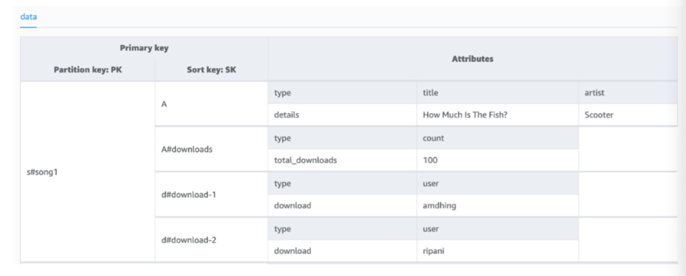

# 7. 수직 분할
- 수직 파티셔닝 : 모든 관련 데이터를 동일한 파티션 키 값과 연결
- 수직 파티셔닝이 적합한 상황
- 액세스 패턴에 맞게 어떻게 구현해야하는지

## 아이템 컬렉션에 대한 이해
- 동일한 파티션 키 값을 가지지만 다른 정렬 키 값을 갖는 항목들의 집합
- Query API : 같은 파티션 키 대상으로 sort key에 조건 지정하여 조회 가능
- begins_with() -> GROUP BY 와 유사한 방식으로 정렬키 값 설계 가능
  - 2024년 1월의 사용자 프로필 기록 조회 : sort_key - begins_with('2024-01')

- 여러번 업데이트가 발생하는 경우
  - 정렬키 타임 스탬프 + 고유한 속성값 결합 : 동일 아이템 컬렉션에 여러번 데이터가 기록되어도 유일하게 식별되도록
  - GSI : 파티션 키와 정렬키 조합이 유일할 필요가 없음
  
- 아이템 컬렉션은 논리적 그룹핑 + 네트워크 분할의 영향도 최소화 
-> 읽기 경계의 데이터 집합이 동일 물리적 파티션에 위치하여 한 파티션 장애가 발생하고 다른 파티션 데이터는 성공적으로 접근 가능

- 인기 플레이리스트(특정 곡의 다운로드 수 보기)

- 범용 이름(키 오버로딩) 사용 - PK, SK를 정렬키로 사용

## 수직분할을 위한 데이터 세분화
- 한번의 네트워크 요청으로 관련한 데이터 컬렉션을 모두 가져올 수 있음
- 애플리케이션에서 여러 번 데이터 저장할 필요있을 수 있음
- 데이터 세분화 -> 전반적인 읽기/ 쓰기 작업에 드는 비용을 줄이는데 도움이 됨

- 데이터 세분화 == WCU 최적화 : 아이템 전체 크기 기준으로 WCU 산정되므로 작게 쪼갤수록 WCU도 아낄 수 있음
- 관리해야 할 GSI 수를 줄일 수 있음 : 하나의 GSI에서 다양한 조합을 가져갈 수 있음
- 대량 데이터를 효과적으로 관리 가능 : 400KB 초과하는 데이터의 분할
- 아이템 컬렉션 내에서 데이터를 논리적으로 그루핑 가능 with begints_with

## 수직분할 시 고려해야 할 점
- WCU 최적화 -> 분할한 아이템의 업데이트 자체가 빈번하지 않은 경우
  - 빠른 데이터 쓰기와 정확한 데이터 검색이 요구사항인 경우 -> 여러 세분화된 항목으로 각각 업데이트, 쓰기는 비효율
- 초기 데이터 기록 시 더 높은 비용이 발생할 경우 : 이미 1KB 미만 데이터를 몇 백 바이트 단위로 세분화하는 것 (1KB 단위 요금 부과)
  - 1KB -> 100KB X 10개로 세분화하면 1KB 당 요금 부과하기에 9배나 많이 듬
- 분석 과정에서 다시 통합이 필요할 때

## Naming conventions(문자열일 경우)
- 짧으면서 의미가 명확한 속성 이름 : p_id > person_identifier
- 속성값의 명명규칙 : 엔티티 유형을 파티션 키나 정렬 키 값의 접두사로 표시
  - order_id - o#abcd / person_id - p#1234
 
## 수직 분할이 확장성에 미치는 영향
- NoSQL 시스템의 단점은 애플리케이션 접근 패턴의 60-70%에 대해 미리 알아야 한다는 점
- GSI1PK, GSI1SK 정도로 정의 -> 데이터 모델을 손쉽게 수정하거나 확장 가능
- 400KB 제한 초과상황에서도 시스템의 확장성을 유지 가능
