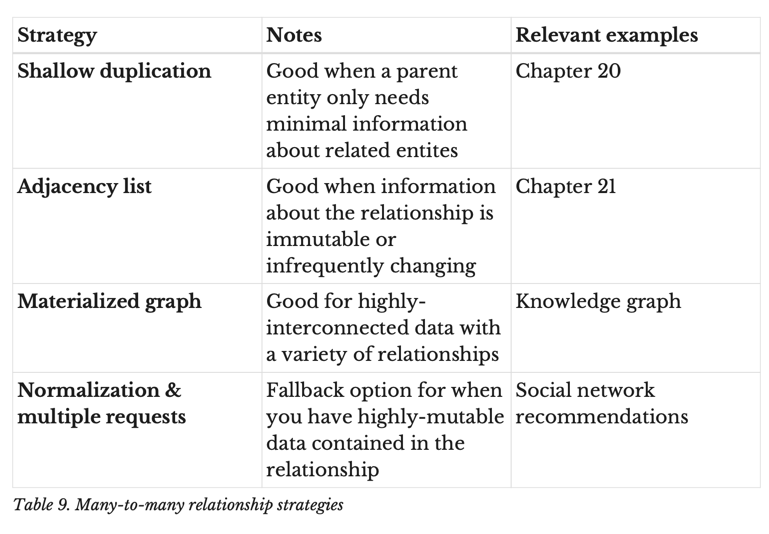
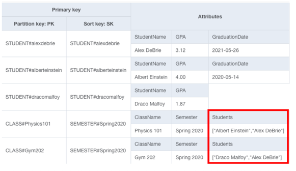
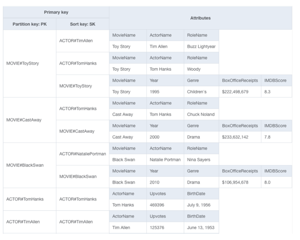
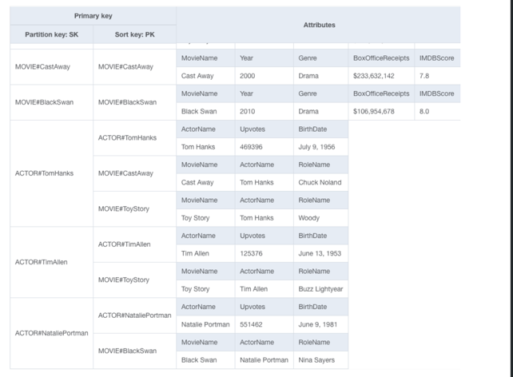
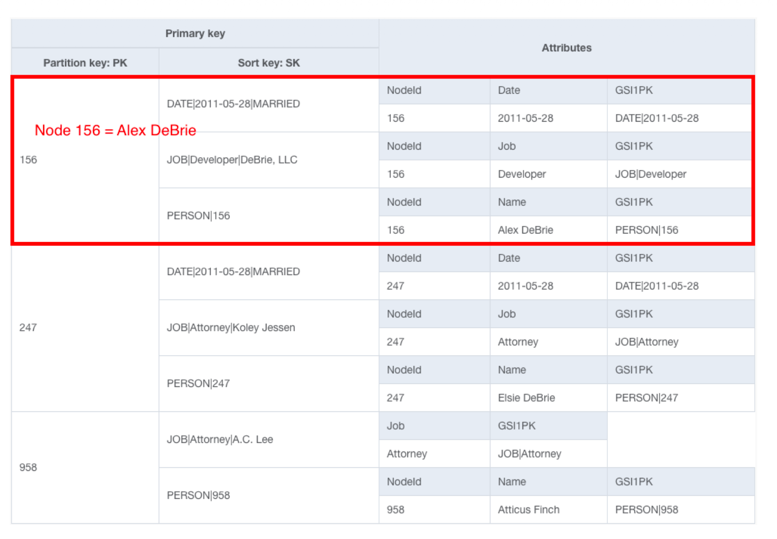
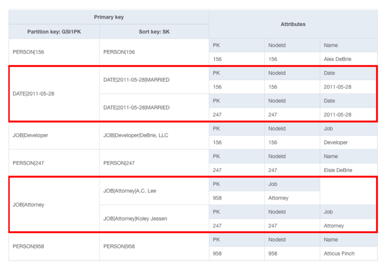
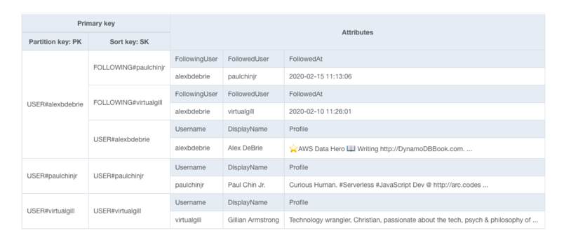

# 12. N:M 매핑 전략

## 결론 4가지 전략

- 전략1. 얕은 복사 : 관계 데이터의 불변인 소량정보만 필요로 할 때
- 전략2. 인접 리스트 : 관계 데이터가 불변이거나 거의 변하지 않을 때(관계성 데이터를 별도 아이템으로)
- 전략3. Materialized graph : 촘촘히 엮여 있는 데이터 관계 표현
- 전략4. 정규화 + 여러번 호출 : 매우 자주 변하는 데이터가 관계사이에 껴있을 때 ex. Twitter

## N:M 관계의 특징
- 각자의 관점에서 관계를 다루어야 하기 때문에 어려움
  - ex) 학생 - 강의 : 학생이 듣는 강의 + 강의에 속한 학생을 둘다 다뤄야함
- RDB :  관계형 테이블을 통해 각 1:N으로 풀어냄

## 전략1. 얕은 복사(Shallow duplication)
- 부모 아이템 안에 연관된 엔티티들의 최소 정보(id)만 리스트 속성으로 복사해두어 한번의 조회로 관계 목록을 가져오는 전략
- 상세 정보가 필요할 때만 id로 개별 아이템을 추가 조회
- 하나의 객체에 관련 M개의 객체 id들을 리스트로 저장 
- 강의를 듣는 학생을 조회할 때 (name, id) 정도만 필요 -> link로 세부정보 이동
- 
- class의 students 속성(수업을 듣는 학생 리스트) -> class 조회 후 students 이름별로 GetItem 반복
- 조건1. 연관된 entity가 한정적일 때
  - item 400KB 제한에 영향 주지 않도록 어느정도 연관된 정보들이 한정적이어야함
- 조건2. 중복 정보가 불변일 때
  - 정보가 자주 변할 때, 참조한 관계 데이터를 찾아 변경해주어야 함 ex) 학생 수강정보가 매번 변하면 class 객체에서도 갱신필요

## 전략2. 인접 리스트(Adjacency list)
- 두 엔티티의 관계 자체를 별도 아이템(PK, 엔티티A, SK, 엔티티 B)로 저장해 한 파티션에 특정 엔티티와 연결된 엔티티 목록을 보이게 하는 전략
- 관계를 뒤집은 GSI를 만들어 Query 한번으로 반대방향 관계를 조회 가능
- top level entity에서 1:N을 충족시키는 것을 만들고, GSI로 스위칭하는 기법

ex) MOVIE, ACTOR에 대해 메인테이블 설계

Movies:
• PK: MOVIE#<MovieName>
• SK: MOVIE#<MovieName>
Actors:
• PK: ACTOR#<ActorName>
• SK: ACTOR#<ActorName>
Roles:
• PK: MOVIE#<MovieName>
• SK: ACTOR#<ActorName

-> MOVIE에 참여한 ACTOR들을 모두 알 수 있음
-> 그럼 반대로 ACTOR가 참여한 MOVIE들은? => PK, SK를 뒤집은 GSI 생성

-> ACTOR별로 PK였던 MOVIE들이 모여있어서 Query API로 한번에 fetch 가능

### Adjacency list의 특징
- 불변 데이터들과 변동이 많은 데이터들을 조합할 때 좋음
  - Movie와 Actor의 변동성은 그대로 챙기면서 Actor라는 불변 데이터는 영향을 받지 않음
- 두 엔티티의 관계가 불변일 때 좋음 -> role에는 변화가 크게 없었음
- 그러나 PK, SK를 바꾸는데 다른 데이터들은 바꾸지 않고 싶을 수 있음 -> GSI1PK, GSI2PK 새로운 속성 만들어 사용가능

## 전략3. Materialized graph
- 그래프 : 노드(사람, 장소, 사물 같은 객체) -> 엣지(노드 간의 관계)

1. 메인 테이블 : 노드를 item collection들로 저장

- NodeId, 노드 하나의 정보를 아이템 하나에 다 넣지 않고 관계별로 여러 아이템에 쪼개어 저장
  - ex) NodeId 156 Alex DeBrie 파티션
    - Persion, 결혼날짜, 직업 등드을 각각의 item으로 분리함
  
2. GSI 관계 기준으로 재그룹핑

  - SK를 GSI의 PK로 사용해 같은 관계를 가진 아이템끼리를 한 파티션에 모음
    - ex) DATE|2011-05-28 -> 이 날짜에 결혼한 사람 정보를 모아 볼 수 있음
    - ex) JOB|Attorney -> 변호사가 직업인 사람 정보들을 모아봄

- 특징
  - niche한 패턴
  - 다양한 종류의 관계로 촘촘히 연결된 데이터에 유용
  - 특정 유형의 엔티티와 그에 연결된 엔티티들을 빠르게 찾을 수 있음

## 전략4. 정규화 + 여러번 요청하기
- 변동이 많고 + 관계형 데이터에서 중복된 정보가 많을 수록 다루기 힘들어짐
  - ex) Twitter 팔로잉 목록을 보면 팔로잉하는 계정들의 정보가 나오는데 이 정보들이 변경이 쉬운 정보들임

### 예시1. 트위터 팔로잉 목록
- 화면에 필요한 정보를 각 item으로 분할하여 모두 포함하면 누군가 프로필을 바꿀때마다 그 사람을 팔로잉하는 혹은 그 사람이 팔로우하는 모든 아이템을 가져와 업데이트 해주어야 함
- 테이블을 User, Following 두개로 쪼갬
- User : PK(USER#<Username>) + SK(USER#<Username>) -> 이름, 프로필 등 상세 정보
- Following : PK(USER#<Username>) + SK(FOLLOWING#<Username>) -> 누구를 팔로우 하는지, 팔로우한 시각 정도만
-> Following에는 잘 안바뀌는 최소한의 정보만 넣음
-> PK가 같아서 한 사용자의 User 아이템과 Following 아이템들이 같은 아이템 컬렉션에 묶임
- 

- 조회는 2단계로 
- 1단계 : Query(PK=USER#alexdebrie)로 조회해서 ALEX User에 대한 정보와 그가 팔로우하는 사람들의 Following 아이템을 가져옴
- 2단계 : BatchGetItem : 1단계에서 얻은 사용자 이름들로 각 사람의 User 아이템을 한번에 가져옴
-> 자주 바뀌는 다대다 관계라면 이게 최선임

### 예시2. 쇼핑몰 장바구니
- 고객과 상품도 다대다 관계
- 장바구니와 상품을 담을 때는 사이즈, 가격, 상품정보 같은 정보만 얕게 복사해둠
- 결제 단계에서는 상품 원본 데이터를 다시 조회해서 최종 가격과 재고를 확인함
- 즉, 대충 보여줘도 되는 곳에서는 복사본을 쓰고, 정확해야 하는 순간에만 원본을 확인함

