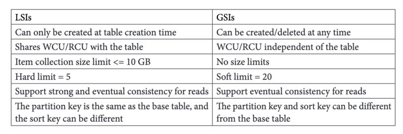

# 8. 보조 인덱스들
- 추가적인 접근 방식 정리
- LSI vs GSI
- 보조 인덱스를 활용한 데이터 모델링을 위한 모범 사례

## 추가적인 액세스 패턴의 사례
- ex1) 전자지갑 : 하나의 지갑의 거래내역 -> 여러 지갑을 가진 유저의 거래내역으로 관점이 변할 때
- ex2) 앱 인증 : 키별로 세션 정보 저장 -> 유저 별로 인증키 저장

## LSI
- 기본 테이블과 동일한 파티션 키 사용 (같은 그룹핑 기준 but, 다른 정렬 기준 사용해야 할 때)
- 기본 테이블의 파티션과 동일한 위치에 데이터를 저장
- 높은 일관성  : 메인 테이블 쓰기 작업은 기본테이블 + LSI가 모두 반영된 후에야 성공한 것으로 간주됨
- 처리량 관리  : LSI에 대한 추가적인 공간 사용료 필요
- 프로젝션 : KEYS_ONLY, INCLUDE, ALL 중에 하나 선택 가능
**- 아이템 컬렉션 총 크기는 10GB를 초과할 수 없다.**
  - 10GB를 넘기면 ItemCollectionSizeLimitExceededException 예외와 함게 거부됨
  - 동일 테이블 내에서 크기가 10GB 미만인 다른 아이템 컬렉션은 정상 동작

- 인덱스 생성 : 테이블 생성 시에 함게 정의되어야 함
- 만약 LSI가 더이상 필요 없어지면?
  - LSI가 없는 테이블로 마이그레이션
  - 데이터에서 LSI 정렬 키 속성을 제거하거나 대체 : 동일 값을 저장하는 다른 이름의 속성을 대체하여 인덱스 반영을 중지시킴

- Shared ThroughPut : r/w 처리량을 base table과 공유
  - 1000 WCU, 3000RCU일 때 (base table + LSI)가 함께 가산됨
  - 3개의 LSI가 있는 테이블에서는 하나의 항목 업데이트 + 3개의 LSI 업데이트로 총 4 WCU가 필요해질 수 있음 -> 사실상 초당 1000/4= 250WCU로 제한됨
  
**- 지원되는 작업들**
  - 단일 항목을 읽어오는 작업은 지원되지 않음 -> 파티션 키 + LSI 정렬 키 값이 동일할 수 있기에 GetItem, BatchGetItem 등은 수행 못함
  - LSI에 포함되지 않은 속성들에 대해서도 기본 테이블 데이터 검색 가능
    - 생성시에는 a 속성만 프로젝션 -> 추후에 b속성도 추가
    - 프로젝션 되지 않은 속성이 요청될 때 기본 테이블 데이터를 추가로 검색하여 속성을 가져옴
      

## GSI
- 최종적 일관성 : 어느정도 지연을 감당해야함
- 처리량 및 스토리지 관리
  - 별개의 WCU, RCU 처리율 제한을 가짐
  - 기본 테이블 처리량과 RCU.WCU가 공유되지 않음
- 프로젝션 : KEYS_ONLY, INCLUDE, ALL 중에 하나 선택 가능
- 독특한 특성들
  - 프로젝션 유형에 따라 기본 테이블의 파티션키와 정렬 키 속성을 반영함
  - 두 속성의 조합을 통해 GSI 내의 항목이 고유하게 식별됨
- GSI 내의 항목 컬렉션에 대해 데이터 크기에 어떠한 제한도 두지 않음

- 기본 테이블에 이미 데이터가 있는 상황에서 GSI 생성 -> 백필
  - 기본 테이블 모든 데이터를 읽어 GSI 키 스키마와 비교함
  - 데이터를 읽는 것은 무료, 백필 과정에서 GSI에 데이터를 쓰는 건 유료
  - 백필 과정의 소요시간은 GSI WCU 수에 따라 달라짐

### GSI를 사용할 때 고려해야할 점
- 처리량 및 스토리지 관리 : 기본 테이블과 공유하지 않기 때문에 별도 관리 필요
- GSI 역 압력 : 기본 테이블로 유입되는 트래픽으로 인해 GSI 백 프레셔 발생 -> GSI/Main Table 모두 요청 처리 제한 가능

- 지원되는 작업들
  - 단일 항목을 읽어오는 작업은 불가함 -> 동일 파티션 키 + 정렬 키값을 가진 여러 항목이 있을 수 있기 때문
  - GSI의 기본키 혹은 정렬키가 업데이트되었다면 아이템을 삭제 -> 새로운 아이템 산입 순으로 이루어짐
    - 이 과정에서 WCU가 2배 소비되므로 기본 테이블에 비해 높은 쓰기 성능을 할당하는 것이 좋음

# LSI vs GSI

# 모범 사례들
- 희소 인덱스 패턴 사용
- Keys_Only 인덱스 활용해서 두번 요청하기
  - 대량 데이터 저장 혹은 평균 지연 시간이 10밀리초를 넘어도 괜찮은 작업에 있어 효과적
- 쓰기 샤딩 N 수 정하기 
  - 1000WCU에 맞도록 정해보기 ex) 초당 100000이 예상됨 -> 1000으로 나누면 총 100개의 샤드가 필요해짐을 알 수 있음
  - 특정 속성을 기반으로 계산 가능한 샤드 접미사를 붙이면 따로 매핑 테이블 없이 바로 파티션 키를 계산 가능
- 카디널리티가 낮은 속성으로 인덱싱하기 -> status가 아니라 isTrue 등의 속성으로 희소 인덱스 사용가능
- 읽기가 쓰기보다 훨씬 많은 경우
  - 3000 RCU 제한이 걸릴 수 있음 -> 기본 테이블과 동일한 키 구조를 가진 GSI 생성
    - 읽기 전용 복제본 같은 역할을 함
    - 파티션 당 초당 읽기 처리량이 두 배가 됨 

### Ref
- DDB 치트 시트 만들기
aws 5번 링크
